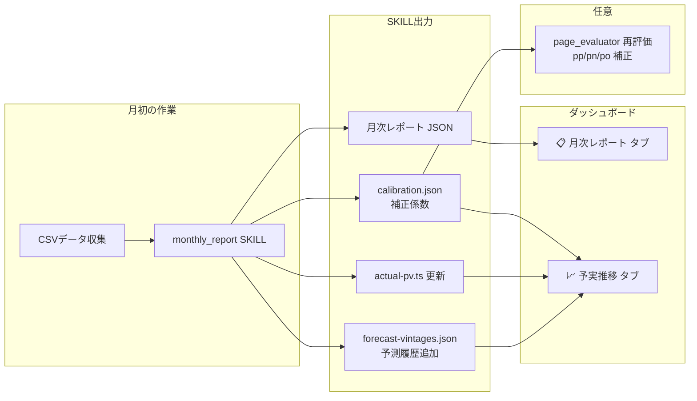

# 月次レポート生成 & 予測キャリブレーションシステム 設計書

> 作成日: 2026-05-01
> ステータス: 承認済み・実装中

毎月、GA4 / Google Search Console / Bing WebMaster のデータと売上情報をもとに、前月のサイトパフォーマンスレポートを自動生成し、予測のキャリブレーション（実績反映）を行い、すべてを既存ダッシュボードから参照できるようにする。

## システム全体像



---

## 1. Forecast Vintage（予測履歴）設計

### 1-1. コンセプト

予測を更新するたびに「ビンテージ（版）」として保存し、**どの時点の予測がどれだけ正確だったか**を追跡可能にする。

```
時間軸 →

v0 (初期予測)    ──────────────────────────────────→ 
v1 (4月実績反映)      ──────────────────────────────→
v2 (5月実績反映)           ──────────────────────────→
実績 (Actuals)   ■■■■■■■■■■■■■■ (毎月蓄積)
```

### 1-2. データ構造

```typescript
// src/types/forecast.ts

interface ForecastVintage {
  id: string;                    // "v0_initial", "v1_202604", "v2_202605"
  createdAt: string;             // ISO8601
  label: string;                 // "初期予測", "4月実績反映"
  trigger: "initial" | "calibration";
  
  // キャリブレーション情報（v1以降）
  calibration?: {
    baseMonth: string;           // 実績反映元の月 "2026-04"
    factors: Record<string, number>;   // stream別補正係数
    streamAccuracy: Record<string, {   // stream別の予実精度
      forecastPv: number;
      actualPv: number;
      accuracy: number;          // actual / forecast (%)
    }>;
    overallAccuracy: number;     // 全体の予測精度 (%)
  };
  
  // この時点での全月予測（BasePVRow[]と同じ形式）
  forecasts: Array<{
    m: string;                   // "Apr'26"
    mp: string;                  // "4月"
    pv: Record<string, number>;  // stream別PV
  }>;
}

interface ForecastHistory {
  currentVintageId: string;      // 現在アクティブなビンテージ
  vintages: ForecastVintage[];   // 全ビンテージの配列
}
```

### 1-3. 格納ファイル

```
src/data/forecast-vintages.json
```

- **v0 (初期予測)**: 現在の `baseline-pv.ts` の内容をそのまま保存
- **v1 (4月実績反映)**: 3月・4月の実績データからキャリブレーション係数を算出し、5月以降の予測を更新
- **vN (毎月追加)**: 新しい実績が入るたびにビンテージを追加

### 1-4. actual-pv.ts の拡張

```typescript
// 現在: 3月のみ → 4月も追加
export const ACTUAL_PV_OBJ: BasePVRow[] = [
  { m: "Mar'26", mp: "3月", pv: { ... }, rev: { ... } },
  { m: "Apr'26", mp: "4月", pv: { ... }, rev: { ... } },  // NEW
];
```

### 1-5. baseline-pv.ts の扱い

- **初回**: 現在の内容を v0 として forecast-vintages.json に保存
- **キャリブレーション後**: baseline-pv.ts は**最新ビンテージの予測値**で上書きする（ダッシュボードの既存ロジックとの互換性を維持）
- **履歴**: forecast-vintages.json に全バージョンが残るため、baseline-pv.ts は常に「最新の最良予測」を反映

---

## 2. 月次レポート仕様

### 2-1. データソース

| ファイル | ソース | 主要カラム |
|---|---|---|
| `YYYYMM.csv` | GA4 | ページパス, 表示回数, ユーザー, エンゲージメント時間, キーイベント, 収益 |
| `YYYYMM_google.csv` | GSC | ページURL, クリック, 表示回数, CTR, 掲載順位 |
| `YYYYMM_bing.csv` | Bing | ページURL, Impressions, Clicks, CTR, Avg Position |

### 2-2. レポートの分析セクション

#### 1. サマリー
- 総PV / ユーザー数 / キーイベント / 売上
- 前月比較（あれば）
- ハイライト3項目

#### 2. トラフィック分析
- ストリーム別PV（URLパスからstream自動判定）
- 言語別(JP/EN)内訳
- Top 10ページ
- 新規ページ検出

#### 3. 検索パフォーマンス
- Google / Bing 各サマリー
- 検索エンジン比較
- CTR 0%の改善機会ページ
- **画像検索パスは除外**

#### 4. エンゲージメント
- 高エンゲージメントTop 10
- 低エンゲージメント検出
- キーイベント発生ページ

#### 5. コンバージョン
- CV発生ページとCV率
- ホテルページのCV集中度

#### 6. 予実対比 & キャリブレーション
- ストリーム別の予測 vs 実績
- **予測精度の推移**（前回ビンテージ→今回ビンテージで精度がどう変化したか）
- キャリブレーション係数の算出結果

#### 7. アクションアイテム
- CTR改善候補
- エンゲージメント改善候補
- CVポテンシャルページ

### 2-3. レポートJSONスキーマ

```typescript
// src/types/report.ts

interface MonthlyReport {
  reportMonth: string;           // "2026-03"
  generatedAt: string;
  generatedBy: "skill";
  periodStart: string;
  periodEnd: string;
  revenue: number;

  summary: {
    totalPageviews: number;
    totalUsers: number;
    totalKeyEvents: number;
    totalRevenue: number;
    highlights: string[];
    momComparison?: {
      pageviewsChange: number;
      usersChange: number;
      keyEventsChange: number;
    };
  };

  traffic: {
    byStream: Array<{
      stream: string;
      label: string;
      pageviews: number;
      users: number;
      pagesCount: number;
    }>;
    byLanguage: {
      jp: { pageviews: number; users: number };
      en: { pageviews: number; users: number };
    };
    topPages: Array<{
      path: string;
      pageviews: number;
      users: number;
      avgEngagementTime: number;
      keyEvents: number;
    }>;
    newPages: string[];
  };

  search: {
    google: {
      totalClicks: number;
      totalImpressions: number;
      avgCtr: number;
      avgPosition: number;
      topPages: Array<{
        url: string;
        clicks: number;
        impressions: number;
        ctr: number;
        position: number;
      }>;
      zeroCtrPages: Array<{
        url: string;
        impressions: number;
        position: number;
      }>;
    };
    bing: {
      totalClicks: number;
      totalImpressions: number;
      avgCtr: number;
      avgPosition: number;
      topPages: Array<{
        url: string;
        clicks: number;
        impressions: number;
        ctr: number;
        position: number;
      }>;
    };
    engineComparison: {
      googleShare: number;
      bingShare: number;
    };
  };

  engagement: {
    topEngagedPages: Array<{
      path: string;
      avgEngagementTime: number;
      users: number;
    }>;
    lowEngagementPages: Array<{
      path: string;
      avgEngagementTime: number;
      users: number;
    }>;
    keyEventPages: Array<{
      path: string;
      keyEvents: number;
      users: number;
      cvRate: number;
    }>;
  };

  conversion: {
    totalKeyEvents: number;
    totalRevenue: number;
    topCvPages: Array<{
      path: string;
      keyEvents: number;
      users: number;
      cvRate: number;
    }>;
    hotelCvSummary: {
      totalKeyEvents: number;
      pages: Array<{
        path: string;
        keyEvents: number;
        cvRate: number;
      }>;
    };
  };

  forecastComparison: {
    vintageId: string;
    byStream: Array<{
      stream: string;
      label: string;
      forecastPv: number;
      actualPv: number;
      accuracy: number;
    }>;
    overallAccuracy: number;
    calibrationApplied: {
      newVintageId: string;
      factors: Record<string, number>;
    };
  };

  actionItems: Array<{
    category: "ctr" | "engagement" | "conversion" | "content";
    priority: "高" | "中" | "低";
    description: string;
    targetPages: string[];
  }>;
}
```

---

## 3. ダッシュボードUI

### 3-1. 新規タブ構成

既存5タブに2タブ追加:

| タブ | 内容 |
|---|---|
| 📋 概要 | (既存) |
| 📊 グラフ | (既存) |
| 📅 月次一覧 | (既存) |
| 🔍 ページ評価 | (既存) |
| 📊 品質評価 | (既存) |
| **📋 月次レポート** | **NEW**: 月選択 → レポート各セクション表示 |
| **📈 予実推移** | **NEW**: 予測ビンテージ比較 × 実績のライン/バーチャート |

### 3-2. 月次レポートタブ

- 月セレクター（ドロップダウン）
- セクション別のカード表示
- 前月比の↑↓インジケーター
- アクションアイテムの優先度別表示

### 3-3. 予実推移タブ（Forecast Evolution）

```
 PV
  │  ━━ 実績 (Actuals)
  │  ─── v0 初期予測
  │  ─ ─ v1 4月反映
  │  · · · v2 5月反映
  │
  │           ■
  │        ■ /  · · ·
  │     ■ / ─ ─ ─
  │  ■ / ───────
  └──────────────────── 月
    3月  4月  5月  6月  ...
```

- ストリーム選択で絞り込み
- ビンテージ ON/OFF トグル
- 予測精度の推移グラフ（v0: 21% → v1: 85% → ...）
- 各ビンテージのキャリブレーション係数の表示

---

## 4. SKILL設計

### 4-1. monthly_report SKILL

#### ファイル構成
```
.agent/skills/monthly_report/
├── SKILL.md                    # メインの手順書
├── resources/
│   ├── report_spec.md          # レポート仕様書
│   ├── stream_mapping.md       # URLパス → stream のマッピングルール
│   └── calibration_logic.md    # キャリブレーション算出ロジック
└── examples/
    └── sample_report.json      # 出力サンプル
```

#### SKILL実行フロー
```
Step 1: データ読み込み
  - src/data/actual_dl/YYYYMM.csv
  - src/data/actual_dl/YYYYMM_google.csv
  - src/data/actual_dl/YYYYMM_bing.csv
  - src/data/forecast-vintages.json (最新ビンテージ)
  - src/reports/前月.json (前月比較用、あれば)

Step 2: レポートJSON生成
  - 7セクションを算出
  - src/reports/YYYYMM.json に保存

Step 3: キャリブレーション
  - ストリーム別の予実比を算出
  - 補正係数を生成
  - 新ビンテージを forecast-vintages.json に追加
  - baseline-pv.ts を最新予測で更新

Step 4: actual-pv.ts に当月の実績を追加

Step 5: 確認
  - npm run build でビルドチェック
```

### 4-2. page_evaluator への拡張（任意）

eval_spec.md に以下のオプショナルフェーズを追加:

```markdown
### Phase 2.5: キャリブレーション参照（オプション）
calibration.json が存在する場合、該当ストリームの補正係数を
pp/pn/po 配列に乗算して、実績に基づいた予測値に調整する。
```

---

## 5. 変更対象ファイル一覧

### 新規作成

| ファイル | 内容 |
|---|---|
| `src/types/forecast.ts` | ForecastVintage, ForecastHistory 型定義 |
| `src/types/report.ts` | MonthlyReport 型定義 |
| `src/data/forecast-vintages.json` | 予測履歴（v0初期値 + v1キャリブレーション済み） |
| `src/reports/202603.json` | 3月レポート |
| `src/reports/202604.json` | 4月レポート |
| `src/components/ReportTab.tsx` | 月次レポートタブ |
| `src/components/ForecastTab.tsx` | 予実推移タブ |
| `.agent/skills/monthly_report/SKILL.md` | レポート生成SKILL |
| `.agent/skills/monthly_report/resources/*.md` | SKILL参照資料 |

### 修正

| ファイル | 変更内容 |
|---|---|
| `src/App.tsx` | 2タブ追加、forecast-vintages読み込み |
| `src/App.css` | 新タブ用スタイル |
| `src/data/actual-pv.ts` | 4月実績追加 |
| `src/data/baseline-pv.ts` | キャリブレーション反映（v1予測で更新） |
